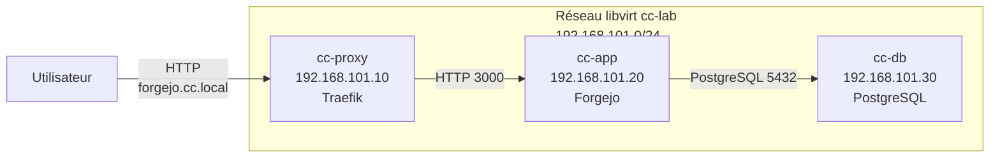
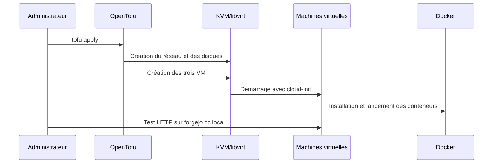

# TP Cloud Computing

> Louis WALTER

## 1. Introduction et contexte

Une PME souhaite moderniser l'hébergement de sa forge Git interne. Avant
ce projet, l'application était installée manuellement sur un serveur unique, ce
qui rendait les déploiements difficiles à reproduire.

L'objectif est de proposer une infrastructure simple, automatisée et documentée,
basée sur trois principes du Cloud Computing :

- virtualiser les serveurs avec des machines virtuelles
- isoler les services avec des conteneurs Docker
- automatiser le déploiement avec OpenTofu (fork de Terraform).

La solution déploie la forge Git [Forgejo](https://forgejo.org) derrière un reverse proxy Traefik.
La base de données PostgreSQL est séparée sur une machine virtuelle dédiée.

## 2. Présentation de l'architecture

L'architecture repose sur trois machines virtuelles Ubuntu.

| VM         |       Adresse IP | Rôle            | Conteneur  |
| ---------- | ---------------: | --------------- | ---------- |
| `cc-proxy` | `192.168.101.10` | Reverse proxy   | Traefik    |
| `cc-app`   | `192.168.101.20` | Application web | Forgejo    |
| `cc-db`    | `192.168.101.30` | Base de données | PostgreSQL |

L'utilisateur accède uniquement au reverse proxy via `forgejo.cc.local`.
Traefik transmet ensuite les requêtes HTTP vers Forgejo, puis Forgejo utilise
PostgreSQL pour stocker ses données.



Ce découpage évite de tout installer sur un seul serveur.
Il rend l'architecture plus claire et limite l'exposition directe de l'application et de la base de données.

## 3. Infrastructure virtualisée

L'infrastructure est créée sur KVM/libvirt avec le provider [`dmacvicar/libvirt`](https://search.opentofu.org/provider/dmacvicar/libvirt/latest).
Le projet utilise un réseau virtuel NAT nommé `cc-lab`.

| Élément         | Valeur                   |
| --------------- | ------------------------ |
| Réseau          | `192.168.101.0/24`       |
| Passerelle      | `192.168.101.1`          |
| Domaine interne | `cc.local`               |
| Mode réseau     | NAT                      |
| Image VM        | Ubuntu 26.04 cloud image |

Les machines virtuelles sont créées à partir d'une image cloud Ubuntu. Les
disques sont au format `qcow2`, ce qui convient à un environnement
KVM/libvirt local.

| VM         | vCPU |  Mémoire | Disque |
| ---------- | ---: | -------: | -----: |
| `cc-proxy` |    1 | 1024 MiB | 10 GiB |
| `cc-app`   |    2 | 2048 MiB | 20 GiB |
| `cc-db`    |    2 | 2048 MiB | 20 GiB |

cloud-init configure chaque machine au premier démarrage : réseau, paquets,
scripts, unités systemd et lancement des conteneurs Docker.

## 4. Déploiement automatisé

Le déploiement est automatisé avec OpenTofu. Le code principal est organisé dans
trois fichiers :

- `main.tf` : réseau, volumes, machines virtuelles, cloud-init et sorties ;
- `variables.tf` : variables de configuration ;
- `README.md` : commandes et tests.

Le déploiement complet se lance avec :

```shell
tofu apply
```

La suppression de l'environnement se fait avec :

```shell
tofu destroy
```

Le déroulement général est le suivant :



Cette automatisation permet de reconstruire l'environnement sans configuration
manuelle serveur par serveur.

## 5. Conteneurisation

Les trois services principaux sont lancés dans des conteneurs Docker. Cela évite
d'installer directement les applications sur le système et facilite leur
redémarrage.

| Service    | Image                             |   Port | Persistance                  |
| ---------- | --------------------------------- | -----: | ---------------------------- |
| Traefik    | `traefik:v3`                      |   `80` | Configuration `/etc/traefik` |
| Forgejo    | `codeberg.org/forgejo/forgejo:15` | `3000` | `/opt/forgejo/data`          |
| PostgreSQL | `postgres:17-alpine`              | `5432` | `/opt/forgejo/postgres`      |

Traefik reçoit les requêtes HTTP et les redirige vers Forgejo. Forgejo est
l'application web utilisée dans le projet. PostgreSQL stocke les données de
Forgejo dans un volume persistant.

Le conteneur Forgejo attend que PostgreSQL soit joignable avant de démarrer.
Cela évite une erreur au premier lancement si la base de données n'est pas
encore prête.

## 6. Réseau et accès

L'accès utilisateur passe par le nom `forgejo.cc.local`, qui doit pointer vers
le reverse proxy.

Entrée à ajouter sur le poste hôte :

```text
192.168.101.10 forgejo.cc.local
```

Flux réseau principaux :

| Source      | Destination |     Port | Usage                         |
| ----------- | ----------- | -------: | ----------------------------- |
| Utilisateur | `cc-proxy`  |     `80` | Accès HTTP                    |
| `cc-proxy`  | `cc-app`    |   `3000` | Routage vers Forgejo          |
| `cc-app`    | `cc-db`     |   `5432` | Connexion PostgreSQL          |
| VM          | Internet    | `80/443` | Installation et images Docker |

Le reverse proxy sert de point d'entrée unique. Il masque l'adresse de
l'application et permettra plus tard d'ajouter facilement HTTPS.

Test sans modifier `/etc/hosts` :

```shell
curl -fsS -H 'Host: forgejo.cc.local' http://192.168.101.10/
```

Test avec `/etc/hosts` configuré :

```shell
curl -fsS -I http://forgejo.cc.local/
```

On peut maintenant accéder à la page de setup initial de l'application depuis http://forgejo.cc.local

## 7. Analyse et justification des choix

KVM/libvirt a été choisi car c'est une solution de virtualisation open source.

OpenTofu est un fork open-source de Terraform et permet de faire de l'Infrastructure as Code (déploiement versionnable et reproductible).

Docker simplifie l'installation des services.
Chaque composant garde ses propres dépendances et peut être relancé indépendamment.

Le découpage en trois machines virtuelles est volontairement simple :

- `cc-proxy` expose uniquement l'entrée HTTP
- `cc-app` héberge l'application
- `cc-db` isole les données

Les limites actuelles sont :

- pas de HTTPS
- les secrets sont dans les variables du projet
- pas de sauvegarde automatique
- pas de haute disponibilité
- pas de supervision

Un pipeline d'intégration continue est mis en place avec GitHub Actions dans `.github/workflows/ci.yml`.

Il lance les commandes `tofu init`, `tofu fmt -check` et `tofu validate`.

## 8. Conclusion

Ce projet répond au sujet en proposant une infrastructure virtualisée, conteneurisée et automatisée.
L'application Forgejo est séparée de la base de données et protégée par un reverse proxy.

La solution est simple, mais montre les notions principales du module : machines virtuelles, réseau, conteneurs, Infrastructure as Code et automatisation du déploiement.
